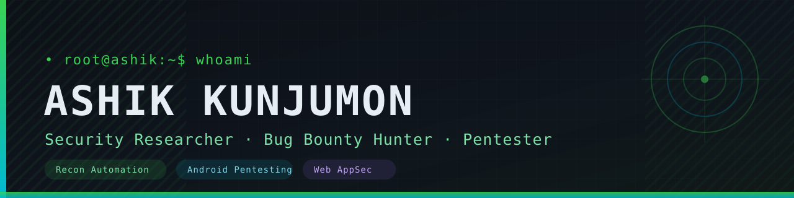

<!-- ─────────────────────────────  HEADER  ───────────────────────────── -->
<div align="center">
  
</div>

<!-- ────────────────────────────  SOCIALS  ───────────────────────────── -->
<div align="center">

[](https://ashikkunjumon.netlify.app) [](https://twitter.com/ashikkunjumon3) [](https://www.linkedin.com/in/ashikkunjumon/) [](https://www.instagram.com/aashique_k_/) [](https://www.facebook.com/aashque.k)

</div>

---

## `$ whoami`

```console
root@ashik:~$ whoami --verbose
```

Hey, I'm **Ashik** 👋 — a security researcher who spends most of my time breaking
things on purpose. I hunt bugs, automate recon, and tear apart Android apps to see
what falls out.

- 🛡️ Focused on **web application security**, **API testing**, and **Android pentesting**
- 🤖 Interested in **LLM-assisted vulnerability discovery** and offensive automation
- 📝 Documenting findings at **[cve-reports](https://github.com/ashikkunjumon/cve-reports)**
- 🌐 More about me → **[ashikkunjumon.netlify.app](https://ashikkunjumon.netlify.app)**

---

## `$ ./snake --contributions`

<div align="center">
  <picture>
    <source media="(prefers-color-scheme: dark)" srcset="https://raw.githubusercontent.com/ashikkunjumon/ashikkunjumon/output/github-contribution-grid-snake-dark.svg" />
    <source media="(prefers-color-scheme: light)" srcset="https://raw.githubusercontent.com/ashikkunjumon/ashikkunjumon/output/github-contribution-grid-snake.svg" />
    
  </picture>
</div>
